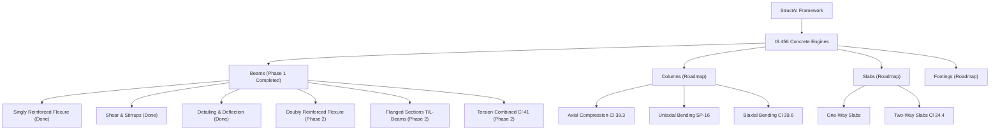

# StructAI — Structural Engineering Design Engine Overview

> [!NOTE]
> **StructAI** is a modular, high-precision Python engineering framework for automated structural design and code compliance checks according to **IS 456:2000** (Indian Standard Code of Practice for Plain and Reinforced Concrete).

---

## 1. Project Architecture & Directory Layout

```
c:/JEEVAN/StructAI/
├── structai/                     # Main Package Root
│   ├── __init__.py               # Package Metadata (__version__ = "0.1.0")
│   ├── core/                     # Fundamental domain abstractions
│   │   ├── __init__.py
│   │   └── datatypes.py          # Dataclasses & Enums for geometry, materials, loads, results
│   └── codes/                    # Standard Building Code Implementation Engines
│       ├── __init__.py
│       └── is456/                # IS 456:2000 Concrete Design Modules
│           ├── __init__.py
│           ├── beam.py           # Unified IS456BeamDesignEngine orchestrator
│           ├── constants.py      # Table 19, Table 20 lookup tables & code constants
│           ├── detailing.py      # Cl 23 (deflection), Cl 26 (rebar details), Cl 26.2 (L_d)
│           ├── flexure.py        # Limit state flexural design (Annex G & Cl 38.1)
│           └── shear.py          # Limit state shear design (Cl 40 & Cl 26.5.1)
├── tests/                        # Comprehensive Unit Test Suite
│   ├── test_beam.py              # End-to-end integrated beam design tests
│   ├── test_detailing.py         # Tests for L_d, span-depth ratio, code check results
│   ├── test_flexure.py           # Tests for Mu_lim, Ast, xu calculation
│   └── test_shear.py             # Tests for tau_v, tau_c interpolation, stirrup spacing
└── examples/                     # Verification & Demonstration Scripts
    └── sample_beam_calc.py       # Standalone executable sample beam design script
```

---

## 2. Core Datatypes & Domain Model (`structai.core.datatypes`)

All calculation inputs and results in StructAI are strictly typed using Python standard dataclasses and enums:

| Class / Enum | Description | Key Attributes / Methods |
| :--- | :--- | :--- |
| [`BeamGeometry`](file:///c:/JEEVAN/StructAI/structai/core/datatypes.py#L38-L64) | Rectangular section dimensions in SI units (mm). | `b` (width), `D` (overall depth), `d` (effective depth), `d_prime` (cover), `span`, `support_condition` |
| [`MaterialProperties`](file:///c:/JEEVAN/StructAI/structai/core/datatypes.py#L67-L93) | Concrete and steel strengths (N/mm²). | `f_ck` (concrete), `f_y` (main steel), `f_yv` (stirrup steel), `E_s`, `is_hysd` |
| [`FactoredLoads`](file:///c:/JEEVAN/StructAI/structai/core/datatypes.py#L95-L118) | Design ultimate loads acting on section. | `M_u` (kNm), `V_u` (kN), `T_u` (kNm). Properties: `M_u_Nmm`, `V_u_N` |
| [`StirrupDetails`](file:///c:/JEEVAN/StructAI/structai/core/datatypes.py#L120-L139) | Shear stirrup configuration details. | `num_legs`, `bar_diameter`, `spacing`, property `A_sv` |
| [`CheckStatus`](file:///c:/JEEVAN/StructAI/structai/core/datatypes.py#L16-L22) | Status outcome for code provisions. | `PASS`, `FAIL`, `WARNING`, `NOT_APPLICABLE`, `NOT_IMPLEMENTED` |
| [`CodeCheckResult`](file:///c:/JEEVAN/StructAI/structai/core/datatypes.py#L24-L34) | Standardized clause audit outcome. | `check_name`, `clause`, `status`, `demand`, `capacity`, `unit`, `message` |
| [`BeamDesignSummary`](file:///c:/JEEVAN/StructAI/structai/codes/is456/beam.py#L25-L35) | Full consolidated design report output. | `geometry`, `materials`, `loads`, `flexure`, `shear`, `detailing`, `is_overall_pass` |

---

## 3. IS 456:2000 Calculation Modules

### A. Flexural Limit State Design ([`flexure.py`](file:///c:/JEEVAN/StructAI/structai/codes/is456/flexure.py))
- **Limiting Neutral Axis Depth ($x_{u,max}$):**
  Calculated per Clause 38.1 Note ($x_{u,max}/d = 0.53$ for Fe 250, $0.48$ for Fe 415, $0.46$ for Fe 500).
- **Limiting Moment of Resistance ($M_{u,lim}$):**
  $$M_{u,lim} = 0.36 \cdot f_{ck} \cdot b \cdot x_{u,max} \cdot (d - 0.42 \cdot x_{u,max})$$
- **Tension Reinforcement Area ($A_{st}$):**
  Derived from quadratic flexural yield equation (Annex G-1.1):
  $$M_u = 0.87 \cdot f_y \cdot A_{st} \cdot d \left(1 - \frac{A_{st} \cdot f_y}{b \cdot d \cdot f_{ck}}\right)$$
- **Minimum & Maximum Steel Limits:**
  - $A_{st,min} = \frac{0.85 \cdot b \cdot d}{f_y}$ (Clause 26.5.1.1 a)
  - $A_{st,max} = 0.04 \cdot b \cdot D$ (Clause 26.5.1.1 b)

### B. Shear Limit State Design ([`shear.py`](file:///c:/JEEVAN/StructAI/structai/codes/is456/shear.py))
- **Nominal Shear Stress ($\tau_v$):** $\tau_v = \frac{V_u}{b \cdot d}$ (Clause 40.1).
- **Maximum Permissible Shear Stress ($\tau_{c,max}$):** Interpolated from Table 20 for concrete grade $f_{ck}$. Section fails if $\tau_v > \tau_{c,max}$.
- **Concrete Design Shear Strength ($\tau_c$):** Bilinear interpolation from Table 19 based on tension steel percentage $p_t = \frac{100 \cdot A_{st}}{b \cdot d}$ and $f_{ck}$.
- **Stirrup Spacing Calculation ($s_v$):**
  - If $\tau_v > \tau_c$: Steel carries net shear $V_{us} = V_u - \tau_c \cdot b \cdot d$. Calculated spacing:
    $$s_v = \frac{0.87 \cdot f_{yv} \cdot A_{sv} \cdot d}{V_{us}}$$
  - **Minimum Shear Steel Spacing Limit:** $s_{v,min} = \frac{0.87 \cdot f_{yv} \cdot A_{sv}}{0.4 \cdot b}$ (Clause 26.5.1.6).
  - **Maximum Code Spacing Limit:** $s_{v,max} = \min(0.75 d, 300\text{ mm})$ (Clause 26.5.1.5).

### C. Detailing & Deflection Control ([`detailing.py`](file:///c:/JEEVAN/StructAI/structai/codes/is456/detailing.py))
- **Development Length ($L_d$):**
  $$L_d = \frac{\phi \cdot \sigma_s}{4 \cdot \tau_{bd}} = \frac{\phi \cdot (0.87 f_y)}{4 \cdot (1.6 \times \tau_{bd,plain})}$$ (Clause 26.2.1, modified by +60% for HYSD bars).
- **Deflection Check via Span-to-Effective-Depth Ratio:**
  - Basic $(L/d)_{basic}$: 7 (Cantilever), 20 (Simply Supported), 26 (Continuous) per Clause 23.2.1.
  - Modification Factor $F_1$: Derived from Fig. 4 empirical formulation using tension stress $f_s = 0.58 \cdot f_y \cdot \frac{A_{st,req}}{A_{st,prov}}$.
  - Pass/Fail check comparing $(L/d)_{actual} \le (L/d)_{allowable} = (L/d)_{basic} \times F_1$.

### D. Integrated Beam Engine ([`beam.py`](file:///c:/JEEVAN/StructAI/structai/codes/is456/beam.py))
Class [`IS456BeamDesignEngine`](file:///c:/JEEVAN/StructAI/structai/codes/is456/beam.py#L38-L60) executes the end-to-end design pipeline in `run_design()`, returning an overall pass/fail status and audit report.

---

## 4. Verification & Testing

The project maintains a unit test suite covering flexure, shear, detailing, and integrated beam design:

```bash
python -m unittest discover -s tests
```

- **Test Suite Status:** 16/16 Unit Tests Passing (0.002s execution time).

---

## 5. Future Development Roadmap

> [!TIP]
> StructAI is structured for seamless extension to support additional IS 456 clauses and structural element types.


